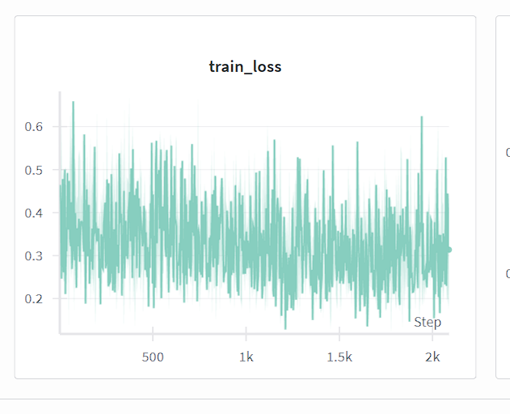
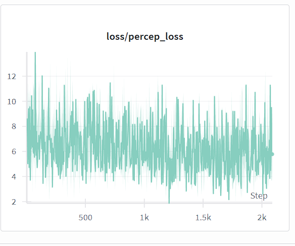
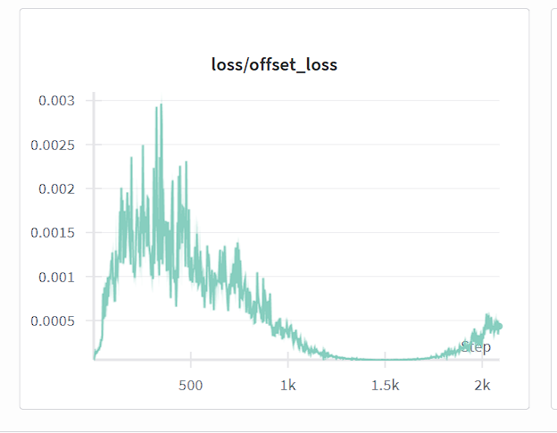
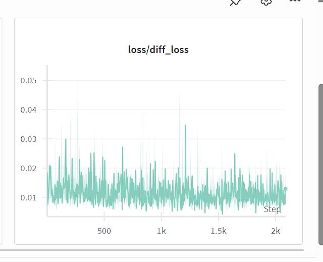

# Báo Cáo Tóm Tắt FontDiffusion

## Giới Thiệu
Đồ án sử dụng PyTorch, Hugging Face Transformers, và Accelerate để hỗ trợ đa GPU. Nó bao gồm các tính năng như tạo hình ảnh batch, đánh giá chất lượng, chia tập dữ liệu, và tích hợp với Hugging Face Hub để upload/download dataset được nhanh hơn so với việc xử lý upload/download trên file thô.

## Những Gì Đã Được Thực Hiện
- **Pipeline tạo dataset**: Tạo hình ảnh font chữ với nhiều ảnh content và ảnh style, cụ thể là các ảnh content từ dữ liệu Hán Nôm Tự Tạo do thầy Điền cung cấp và 15 ảnh style tự sưu tầm trên Internet.
- **Module FST từ bài báo FSTDiff**: Có code tích hợp module Style Transformation Module từ bài báo FSTDiff mặc dù chưa train chưa thành công với module này vì còn gặp nhiều lỗi về tensor dimension và cần phải tích hợp vào pipeline đang có của FontDiffuser nên gặp vài khó khăn về input output số chiều của các tensor.
- **Quản lý Dataset**: Quản lý download/upload dataset từ Hugging Face về máy và ngược lại với tốc độ rất nhanh (xử lý bằng định dạng parquet được phát triển bởi Apache Arrow nên nhanh hơn hẳn so với việc download/upload file thô, có hướng dẫn sử dụng bên dưới), chia tập train/val.
- **Đánh giá**: Có tích hợp module tính toán các chỉ số chất lượng như LPIPS, SSIM, FID.
- **Hỗ trợ đa GPU**: Sử dụng Accelerate library để hỗ trợ inference và training phân tán trên nhiều GPU cùng lúc, điển hình như tận dụng cả 2 GPU của Kaggle.
- **Tích hợp checkpoint**: Sử dụng `results_checkpoint.json` trong mỗi thư mục train_original, train và val để quản lý các data đã sinh.

Các module chính được triển khai bao gồm:
- Quản lý font chữ (FontManager).
- Theo dõi quá trình tạo (GenerationTracker).
- Đánh giá chất lượng (QualityEvaluator).
- Tích hợp với WandB cho logging.
- File orchestrator chính: font_diffusion.ipynb.

Các file dùng để inference gồm có:
- `sample_batch.py`: Đây là file dùng để inference trên 1 GPU.
- `sample_batch_multi_gpus.py`: Đây là file dùng để inference phân tán trên nhiều GPU cùng lúc để tận dụng tối đa quota của Kaggle. Hiện file này đang được dùng chính vì có thể tự động inference bình thường trong trường hợp 1 GPU (Google Colab).

## Cách sử dụng
Từ file `font_diffusion.ipynb` bên dưới, chỉ cần khởi chạy các cell đầu dùng để install package và setup repository từ github, sau đó chỉ cần chạy các cell còn lại theo mong muốn là được. Notebook sẽ git clone toàn bộ repo về kho lưu trữ tạm thời trên nền tảng Cloud (Kaggle, Colab) và dùng các file trong đó để chạy.

### Ví dụ sử dụng các module
- Sinh dataset:
```python
accelerate launch FontDiffusion/sample_batch_multi_gpus.py \
    --characters "NomTuTao/Ds_10k_ChuNom_TuTao.txt" \
    --style_images "FontDiffusion/styles_images" \
    --ckpt_dir "ckpt/" \
    --ttf_path "FontDiffusion/fonts/NomNaTong-Regular.otf" \
    --output_dir "my_dataset/train_original" \
    --num_inference_steps 20 \
    --guidance_scale 7.5 \
    --start_line 3001 \
    --end_line 3200 \
    --batch_size 35 \
    --save_interval 1 \
    --channels_last \
    --seed 42 \
    --compile \
    --enable_xformers
```
- Chia train/val dataset:
```python
python FontDiffusion/create_validation_split.py \
  --data_root my_dataset \
  --val_ratio 0.2 \
  --seed 42
```

- Training:
```python
MAX_TRAIN_STEPS = 1500
accelerate launch FontDiffusion/my_train.py \
    --seed=123 \
    --experience_name="FontDiffuser_training_phase_1" \
    --data_root="my_dataset" \
    --output_dir="outputs/FontDiffuser" \
    --phase_1_ckpt_dir="ckpt" \
    --report_to="wandb" \
      \
    --resolution=96 \
    --style_image_size=96 \
    --content_image_size=96 \
    --content_encoder_downsample_size=3 \
    --channel_attn=True \
    --content_start_channel=64 \
    --style_start_channel=64 \
      \
    --train_batch_size=16 \
    --gradient_accumulation_steps=2 \
    --perceptual_coefficient=0.07 \
    --offset_coefficient=0.6 \
    --max_train_steps={MAX_TRAIN_STEPS} \
    --ckpt_interval={MAX_TRAIN_STEPS // 4} \
    --log_interval=50 \
      \
    --learning_rate=1e-4 \
    --lr_scheduler="cosine" \
    --lr_warmup_steps=200 \
    --drop_prob=0.1 \
    --mixed_precision="fp16"
```
- Upload dataset lên HF:
```python
# Original Split
python FontDiffusion/create_hf_dataset.py \
  --data-dir "my_dataset/train_original" \
  --repo-id dzungpham/font-diffusion-generated-data \
  --split "train_original" \
  --token {HF_TOKEN}

# Train Split
python FontDiffusion/create_hf_dataset.py \
  --data-dir "my_dataset/train" \
  --repo-id dzungpham/font-diffusion-generated-data \
  --split "train" \
  --token {HF_TOKEN}

# Val Split
python FontDiffusion/create_hf_dataset.py \
  --data-dir "my_dataset/val" \
  --repo-id dzungpham/font-diffusion-generated-data \
  --split "val" \
  --token {HF_TOKEN}
```
- Download dataset từ HF:
```python
python FontDiffusion/export_hf_dataset_to_disk.py \
  --output-dir "my_dataset/train_original" \
  --repo-id {HF_USERNAME}/font-diffusion-generated-data \
  --split "train_original" \
  --token HF_TOKEN

python FontDiffusion/export_hf_dataset_to_disk.py \
  --output-dir "my_dataset/train" \
  --repo-id {HF_USERNAME}/font-diffusion-generated-data \
  --split "train" \
  --token HF_TOKEN

python FontDiffusion/export_hf_dataset_to_disk.py \
  --output-dir "my_dataset/val" \
  --repo-id {HF_USERNAME}/font-diffusion-generated-data \
  --split "val" \
  --token HF_TOKEN
```

## Chi tiết các module

### 1. `sample_batch.py`
**Mục đích**: Script chính để tạo hình ảnh font chữ hàng loạt và đánh giá chất lượng. Có hash (content, style, font) của character để đánh dấu chữ nào đã generate tránh trùng lặp và hỗ trợ resume từ checkpoint.

**Chức năng chính**:
- Tải danh sách ký tự từ file hoặc list [a, b, c, d].
- Tải hình ảnh style từ thư mục hoặc file: ảnh png, jpg hoặc thư mục chứa styles ví dụ như styles_images/.
- Tạo hình ảnh content (ký tự) và target (font với style).
- Đánh giá với LPIPS, SSIM, FID nếu có ground truth.
- Lưu checkpoint đã generate vào `results_checkpoint.json`.

### 2. `export_hf_dataset_to_disk.py`
**Mục đích**: Xuất tập dữ liệu từ Hugging Face Hub hoặc local cache về cấu trúc thư mục FontDiffuser được reccommend trong bài báo FontDiffuser để training.

**Chức năng chính**:
- Tải dataset từ HF Hub hoặc disk.
- Tạo cấu trúc folder cho mỗi train, val có 2 subfolder là `ContentImage/` và `TargetImage/`.
- Lưu `results_checkpoint.json`.

**Khi git clone**: Sử dụng để tải dataset từ HF và chuyển về format theo hướng dẫn để file train đọc được folder và train được.

### 3. `create_validation_split.py`
**Mục đích**: Chia tập dữ liệu training thành train và val set.

**Chức năng chính**:
- Chia tập train original thành train và val.
- Cho điều chỉnh val ratio từ command line để tạo.
- Lấy ngẫu nhiên 1 số font và 1 số style làm val và phần còn lại làm train => val gồm có unseen character và unseen style.

**Khi git clone**: Chạy sau khi tạo dữ liệu để chuẩn bị cho đào tạo. Đảm bảo có `results_checkpoint.json` trong thư mục train.

### 4. `create_hf_dataset.py`
**Mục đích**: Tạo tập dữ liệu Hugging Face từ hình ảnh FontDiffusion đã tạo.

**Chức năng chính**:
- Tải metadata từ `results_checkpoint.json`.
- Chuyển đổi hình ảnh thành format HF Dataset ở dạng parquet để upload và download nhanh.
- Push lên HF Hub nếu cần.

**Khi git clone**: Sử dụng để publish dataset lên HF sau khi tạo xong.

### 5. `my_train.py`
**Mục đích**: Script train FontDiffuser gồm 2 phase, có cố gắng tích hợp Style Transformation Module từ paper FSTDiff nhưng còn lỗi tensor dimension.

**Chức năng chính**:
- Hỗ trợ Style Transformation Module.
- Train với loss như diffusion, perceptual, offset, và SC (Phase 2).
- Sử dụng Accelerate cho distributed training.
- Log lên WandB.

**Khi git clone**: Sử dụng để train model. Cần có dataset đã chuẩn bị và checkpoint từ Phase 1 nếu cần.

### 6. `sample_batch_multi_gpus.py`
**Mục đích**: Phiên bản đa GPU của `sample_batch.py` sử dụng Accelerate để training hoặc inference phân tán để tăng tốc.

**Chức năng chính**:
- Tương tự `sample_batch.py` nhưng hỗ trợ multi-GPU.
- Thời gian có thể giảm hơn gấp đôi so với chạy `sample_batch.py` đơn GPU.
- Có thể tạo được khoảng 400 mẫu mới trong khoảng 12p. Trung bình khoảng 1.7 1.8s cho 1 sample.

**Khi git clone**: Sử dụng khi có nhiều GPU để tăng tốc tạo dữ liệu.

# Dataset
Dataset đang dược host tại https://huggingface.co/datasets/dzungpham/font-diffusion-generated-data.
- Train original: tổng lượng data đã generate.
- Train: data dùng để train sau khi split.
- Val: data dùng để val sau khi split.

# Models
Các file model như content encoder, style encoder và unet đang được host ở https://huggingface.co/dzungpham/font-diffusion-weights. Các file đã được convert từ định dạng .pth cũ của tác giả thành file .safetensors để hoà hợp sinh thái của HF và xử lý nhanh hơn.

# Source code
Code đang lưu ở github repository: https://github.com/dzungphieuluuky/FontDiffusion.git

# Notebook
Link notebook Kaggle: https://www.kaggle.com/code/dzung271828/font-diffusion

# Weights and Biases
Dữ liệu training và inference được lưu ở Weights and Biases.
Một số hình ảnh khi train phase 1 từ pretrained model với perceptual loss và offset loss coefficient đã tăng lên so với training script gốc.





# Hướng tiếp theo
- Model gần như đã bão hoà với architecture hiện tại. Nếu tích hợp Style Transformation Module từ FSTDiff thì có thể làm tăng capacity khiến model tốt hơn nhưng cần nhiều thời gian debug các lỗi dimension mismatch giữa các module từ codebase hiện tại của FontDiffuser.
- Có thể kết hợp cả 2 paper lại để áp dụng multi scale extraction cho cả ảnh content và ảnh style. Debug module style transformation và thêm hàm loss consistency và có thể các hàm loss hỗ trợ khác vô hàm loss tổng.