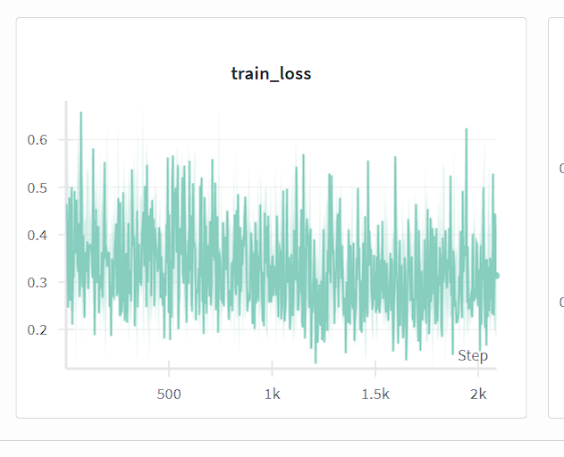
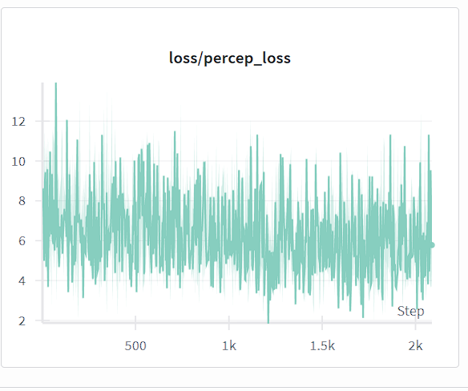
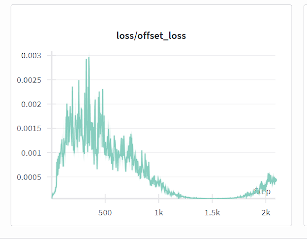
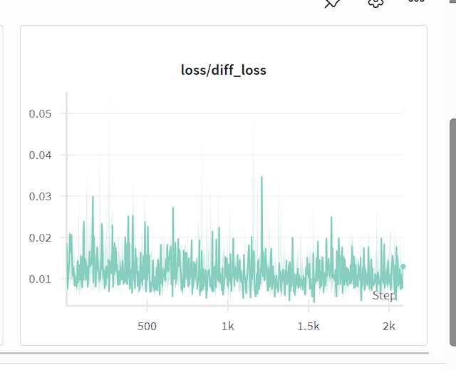

# 1. Overview

## 1.1. Project Architecture

This project comprises four primary modules:

- **Dictionary Module**: Constructs a comprehensive lexicon/character dictionary to support querying and semantic feature extraction. This facilitates information comparison and cross-referencing in subsequent processing stages.

- **Font Diffusion Module**: Generates diverse stylistic variations of individual content characters to enable data augmentation and enhance optical character recognition (OCR) performance. By synthesizing character images through diffusion from base content images and style references, we create a richer set of training variations that improve pattern matching accuracy.

- **Image Comparison and OCR Module**: Performs high-fidelity image matching to produce Unicode character codes, which serve as input to the Levenshtein Alignment module. This module benefits from diffusion-augmented images that maintain visual authenticity while introducing stylistic variation consistent with target inputs. This capability is particularly valuable for disambiguating character pairs with high visual similarity, enabling (image, character) dataset generation.

- **Levenshtein Alignment Module**: Applies the Levenshtein distance algorithm to align character pairs bidirectionally, producing a (character, character) alignment dataset.

## 1.2. Technical Stack

The Font Diffusion module leverages the following core libraries:

- **PyTorch**: Meta's deep learning framework for constructing model architectures.

- **Hugging Face Diffusers**: A comprehensive library for diffusion model implementation, providing critical components including noise schedulers (which manage the denoising schedule) and DPM-Solver (an efficient algorithm for solving stochastic differential equations during the reverse diffusion process).

- **Accelerate**: A distributed training and inference library enabling efficient multi-GPU execution and significantly accelerating computation while maximizing GPU utilization on platforms like Kaggle.

The system encompasses batch image generation, quality assessment mechanisms, dataset management, and seamless integration with Hugging Face Hub for optimized cloud-based storage and model distribution.

# 2. Key Achievements and Features

## Primary Capabilities

- **Dataset Generation Pipeline**: Synthesizes character images from content source images (Sino-Nom characters provided by advisor) and 15 curated style references. Future iterations will expand the style reference corpus to increase dataset diversity, particularly for contrastive learning phases that utilize 16 negative style samples by default.

- **Multi-GPU Support**: Integrates the Accelerate framework for distributed inference and training, maximizing resource utilization across multiple GPUs (e.g., dual Kaggle T4 GPUs).

- **Efficient Dataset Management**: Leverages the Apache Parquet format for superior throughput during upload/download operations from Hugging Face compared to raw file formats.

- **Quality Assessment Module**: Incorporates standard image quality metrics including LPIPS (Learned Perceptual Image Patch Similarity), SSIM (Structural Similarity Index), and FID (Fréchet Inception Distance).

- **Checkpoint Management**: Implements persistent tracking via `results_checkpoint.json` to enable seamless resumption of data generation pipelines.

## Implemented Components

- `FontManager`: Manages font resources and character rendering.
- `GenerationTracker`: Monitors and logs data generation progress and statistics.
- `QualityEvaluator`: Computes perceptual and structural quality metrics.
- **Weights & Biases Integration**: Comprehensive experiment tracking and visualization.
- **FST Module (Font Style Transformation)**: Experimental implementation based on the FSTDiff paper; currently in debugging phase for tensor dimension compatibility.

---

# 3. Source Code Architecture and Module Descriptions

The following sections outline the primary scripts and their respective functions within the repository:

## Data Generation and Inference

- **`sample_batch.py`**: Single-GPU inference script for image synthesis and quality evaluation. Implements hash-based deduplication and supports checkpoint-based resumption.

- **`sample_batch_multi_gpus.py`**: **Recommended** multi-GPU variant. Provides approximate 2× speedup relative to single-GPU inference, achieving ~1.7s per sample.

## Dataset Management

- **`create_hf_dataset.py`**: Converts image collections to Hugging Face Dataset format (Parquet) and uploads to the Hub.

- **`export_hf_dataset_to_disk.py`**: Downloads datasets from Hugging Face Hub and unpacks to standard directory structure (`ContentImage/`, `TargetImage/`) for training pipelines.

- **`create_validation_split.py`**: Partitions datasets into training/validation splits based on user-specified ratios and seed values, ensuring randomization across font and style dimensions.

## Training

- **`my_train.py`**: Primary training script supporting dual-phase training with diffusion, perceptual, and offset loss objectives. Enables distributed training through the Accelerate framework.

---

# 4. Usage Guide

*Note: The Jupyter notebook `font_diffusion.ipynb` (link below) includes pre-configured environments. Execute cells sequentially.*

## Phase 1: Data Generation

Generate training data using distributed inference across multiple GPUs:

```bash
accelerate launch FontDiffusion/sample_batch_multi_gpus.py \
    --characters "NomTuTao/Ds_10k_ChuNom_TuTao.txt" \
    --style_images "FontDiffusion/styles_images" \
    --ckpt_dir "ckpt/" \
    --ttf_path "FontDiffusion/fonts/NomNaTong-Regular.otf" \
    --output_dir "my_dataset/train_original" \
    --num_inference_steps 20 \
    --guidance_scale 7.5 \
    --start_line 3001 \
    --end_line 3200 \
    --batch_size 35 \
    --save_interval 1 \
    --channels_last \
    --seed 42 \
    --compile \
    --enable_xformers
```

## Phase 2: Train/Validation Split

Partition the dataset with validation ratio of 0.2:

```bash
python FontDiffusion/create_validation_split.py \
  --data_root my_dataset \
  --val_ratio 0.2 \
  --seed 42
```

## Phase 3: Model Training

Execute training with Phase 1 configuration:

```bash
MAX_TRAIN_STEPS=1500
accelerate launch FontDiffusion/my_train.py \
    --seed=123 \
    --experience_name="FontDiffuser_training_phase_1" \
    --data_root="my_dataset" \
    --output_dir="outputs/FontDiffuser" \
    --phase_1_ckpt_dir="ckpt" \
    --report_to="wandb" \
    --resolution=96 \
    --style_image_size=96 \
    --content_image_size=96 \
    --content_encoder_downsample_size=3 \
    --channel_attn=True \
    --content_start_channel=64 \
    --style_start_channel=64 \
    --train_batch_size=16 \
    --gradient_accumulation_steps=2 \
    --perceptual_coefficient=0.07 \
    --offset_coefficient=0.6 \
    --max_train_steps={MAX_TRAIN_STEPS} \
    --ckpt_interval={MAX_TRAIN_STEPS // 4} \
    --log_interval=50 \
    --learning_rate=1e-4 \
    --lr_scheduler="cosine" \
    --lr_warmup_steps=200 \
    --drop_prob=0.1 \
    --mixed_precision="fp16"
```

## Phase 4: Dataset Management with Hugging Face

**Upload to Hub:**

```bash
python FontDiffusion/create_hf_dataset.py \
  --data-dir "my_dataset/train_original" \
  --repo-id dzungpham/font-diffusion-generated-data \
  --split "train_original" \
  --token {HF_TOKEN}
```

**Download from Hub to Local Disk:**

```bash
python FontDiffusion/export_hf_dataset_to_disk.py \
  --output-dir "my_dataset/train_original" \
  --repo-id {HF_USERNAME}/font-diffusion-generated-data \
  --split "train_original" \
  --token HF_TOKEN
```

---

# 5. Resources

- **Source Code (GitHub):** [https://github.com/dzungphieuluuky/FontDiffusion.git](https://github.com/dzungphieuluuky/FontDiffusion.git)

- **Jupyter Notebook (Kaggle):** [https://www.kaggle.com/code/dzung271828/font-diffusion](https://www.kaggle.com/code/dzung271828/font-diffusion)

- **Datasets (Hugging Face):** [https://huggingface.co/datasets/dzungpham/font-diffusion-generated-data](https://huggingface.co/datasets/dzungpham/font-diffusion-generated-data)
  
  - **train_original**: Complete synthetic character image dataset.
  - **train/val**: Pre-split dataset ready for training pipelines.

- **Pretrained Model Weights:** Available in SafeTensors format (superior I/O performance and HF ecosystem compatibility):
  
  - `content_encoder.safetensors`
  - `style_encoder.safetensors`
  - `unet.safetensors`
  - `scr_210000.pth` (Phase 2 training checkpoint)
  
  Model Hub: [https://huggingface.co/dzungpham/font-diffusion-weights](https://huggingface.co/dzungpham/font-diffusion-weights)

---

# 6. Experimental Results and Training Metrics

Phase 1 training logs (via Weights & Biases), with adjusted perceptual loss and offset loss coefficients relative to baseline implementation:

- **Training Loss:** 
- **Perceptual Loss:** 
- **Offset Loss:** 
- **Diffusion Loss:** 

---

# 7. Future Directions

1. **Architecture Enhancement:** The current model is approaching saturation with diminishing marginal improvements from higher loss coefficients. Future work will integrate the Style Transformation Module (FST) from the FSTDiff paper to increase model capacity and representational power.

2. **Multi-Scale Feature Extraction:** Combine insights from both FontDiffuser and FSTDiff to implement multi-resolution feature extraction for both content and style encoders.

3. **Auxiliary Loss Functions:** Once tensor dimension compatibility is resolved, introduce consistency losses and complementary loss objectives to further constrain the learned representation.

4. **Comprehensive Validation Framework:** Currently, model performance assessment is limited pending integration with the image comparison module. A robust validation protocol should distinguish three distinct scenarios:
   
   - **Seen Content, Unseen Style (SCUS)**: Evaluates style generalization.
   - **Unseen Content, Seen Style (UCSS)**: Evaluates content generalization.
   - **Unseen Content, Unseen Style (UCUS)**: Evaluates full generalization (primary metric).
   
   This stratification enables targeted ablation studies and component-level performance diagnosis.